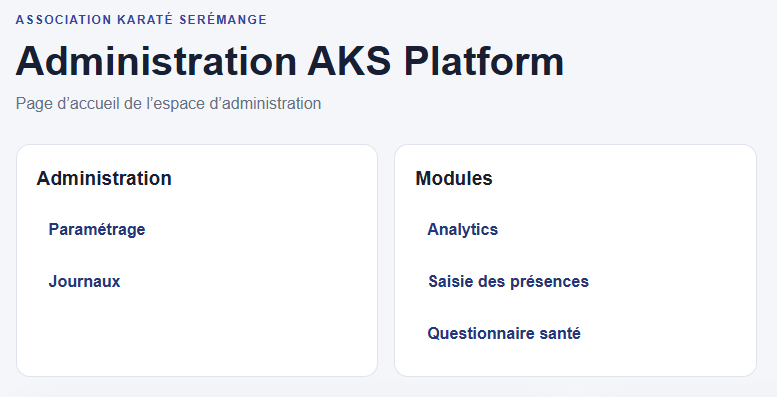
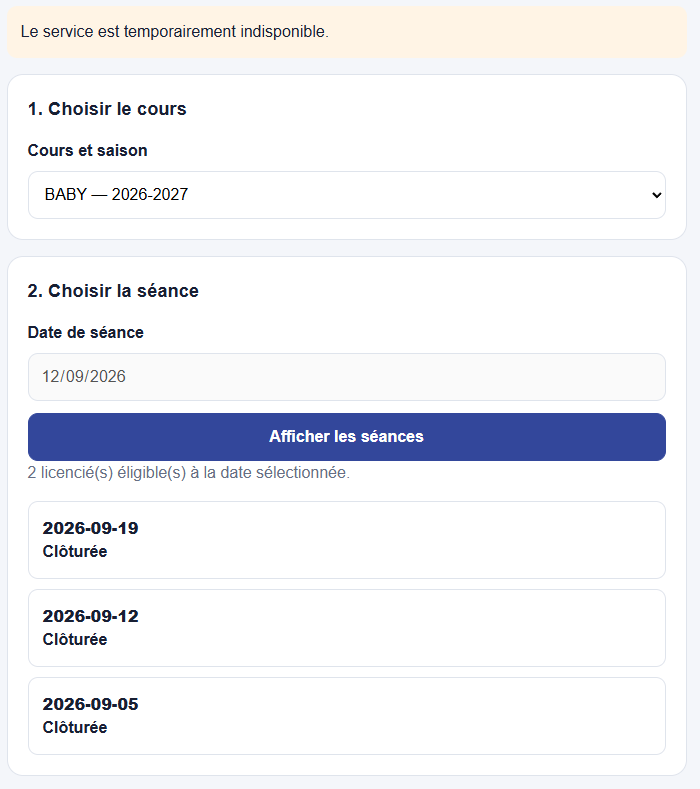
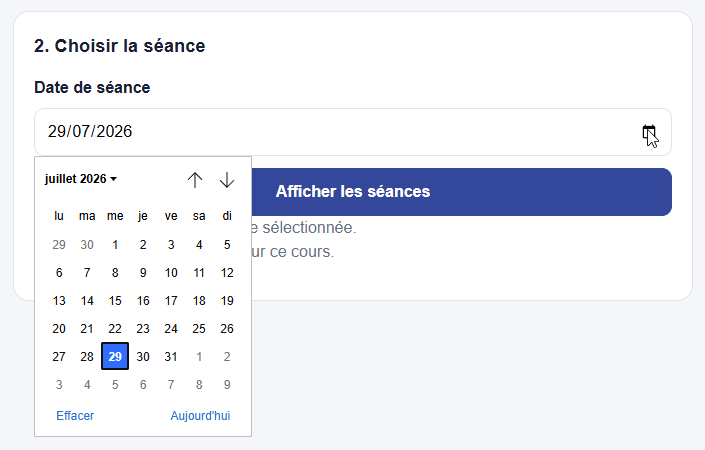
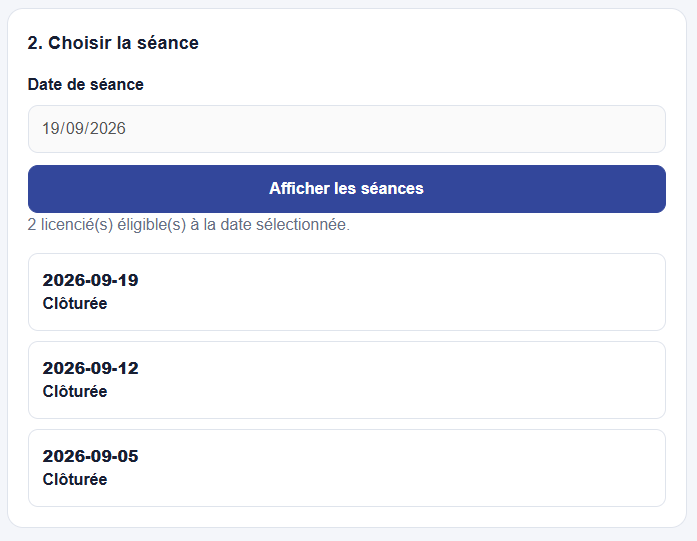
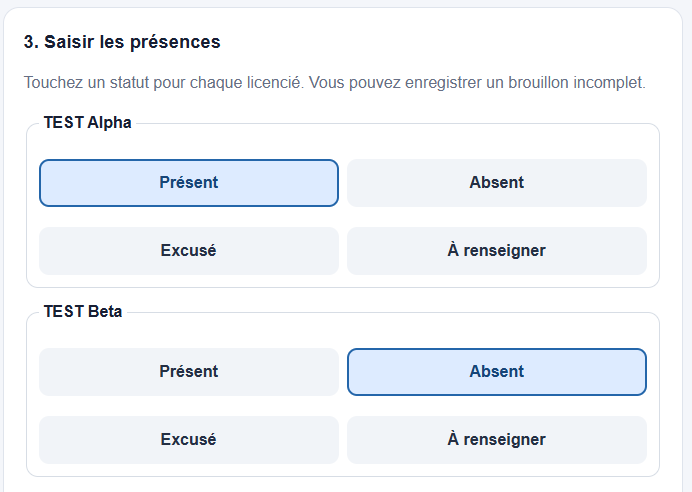
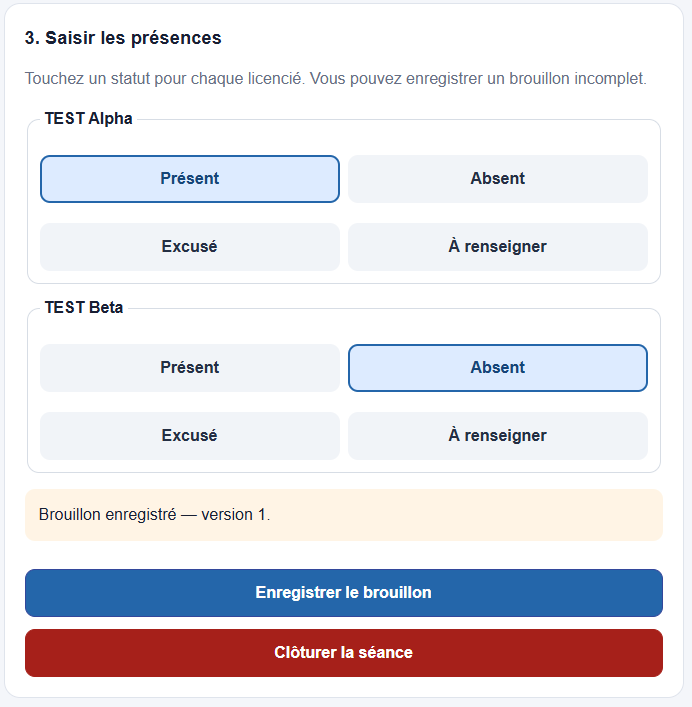
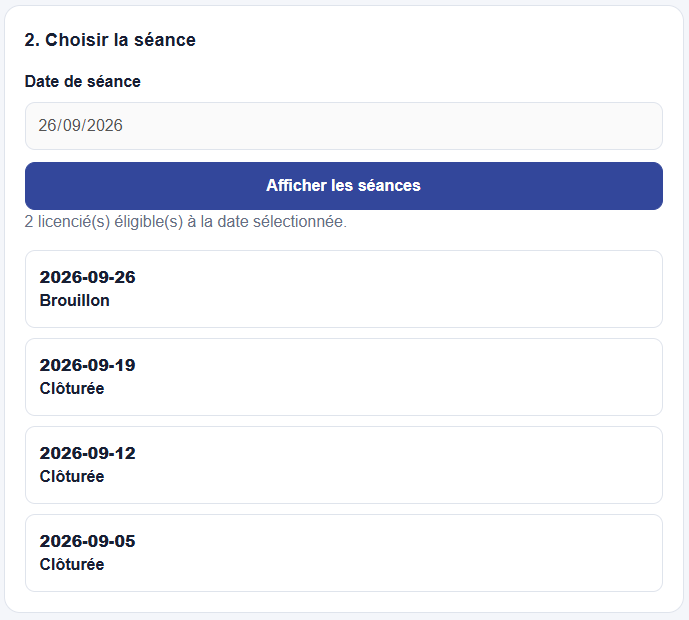
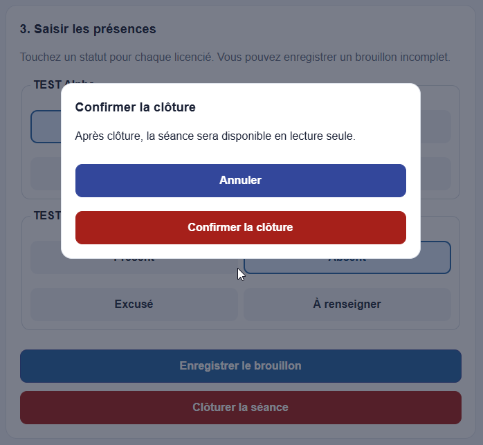
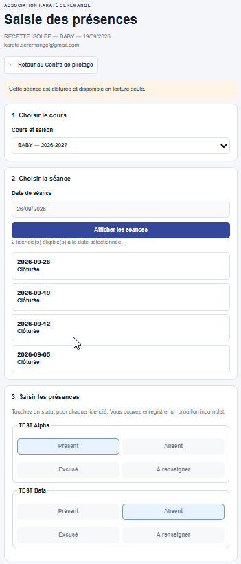

# Guide utilisateur — Saisie des présences

## 1. Objet

Ce guide explique comment saisir, enregistrer, reprendre et clôturer les présences
d'une séance dans AKS Platform.

Il est destiné aux professeurs et assistants autorisés de l'Association Karaté
Serémange. Il décrit le parcours validé sur ordinateur, tablette et téléphone.

## 2. Principes à connaître

- une séance correspond à un cours et à une date ;
- les licenciés proposés dépendent de la saison et de leur affectation au cours ;
- une nouvelle saisie reste modifiable tant qu'elle est enregistrée comme brouillon ;
- la clôture rend la séance définitivement accessible en lecture seule ;
- il ne faut pas créer une seconde séance pour corriger une séance déjà clôturée ;
- les données de la recette sont fictives et ne doivent jamais être confondues avec
  les données de production.

## 3. Accéder au module

1. ouvrir le Centre de pilotage AKS Platform avec un compte autorisé ;
2. dans la rubrique **Modules**, sélectionner **Saisie des présences** ;
3. attendre le chargement complet de la page.

Le module **Saisie des présences** est autonome. Il apparaît au même niveau que
**Analytics** et **Questionnaire santé** ; il ne constitue pas une rubrique
d'Analytics.



*Figure 1 — Accès au module Saisie des présences depuis la rubrique Modules.*

Le bouton **Retour au Centre de pilotage** permet de revenir à l'accueil sans
modifier les données.

## 4. Préparer la séance

### 4.1 Sélectionner le cours

Dans **Cours**, choisir le groupe concerné. Le libellé contient le cours et la
saison, par exemple :

```text
ENFANT_1 — 2026-2027
```

Si aucun cours n'est proposé, vérifier que la saison, le cours et les
autorisations ont été configurés.

### 4.2 Choisir la date

Dans **Date de séance** :

1. cliquer sur l'icône calendrier ;
2. choisir la date réelle du cours ;
3. vérifier la date avant de continuer.

### 4.3 Afficher la séance

Cliquer sur **Afficher les séances**.

L'application affiche :

- le nombre de licenciés éligibles ;
- la liste des licenciés à renseigner ;
- l'historique des séances du cours ;
- une séance existante si un brouillon ou une séance clôturée correspond déjà à
  la date choisie.

Si l'écran indique **0 licencié éligible**, aucune présence ne peut être saisie.
Il faut vérifier l'alimentation des licenciés et leur affectation au cours. Il
n'est pas nécessaire de créer préalablement la séance dans une autre feuille :
elle est créée lors du premier enregistrement.



*Figure 2 — En production, un cours peut être disponible sans licencié encore affecté.*



*Figure 3 — Le calendrier permet de choisir la date de la nouvelle séance.*



*Figure 4 — Recette : deux licenciés fictifs sont disponibles pour la séance du 26/09/2026.*

## 5. Saisir les présences

Pour chaque licencié, choisir un seul statut :

- **Présent** : le licencié a participé au cours ;
- **Absent** : le licencié n'a pas participé au cours.

Avant d'enregistrer, contrôler :

- le cours ;
- la date ;
- l'identité de chaque licencié ;
- l'absence de statut oublié ou inversé.

Sur téléphone ou tablette, faire défiler toute la liste avant de valider.



*Figure 5 — Recette : TEST Alpha est présent et TEST Beta est absent.*

## 6. Enregistrer un brouillon

Cliquer sur **Enregistrer le brouillon**.

Un message confirme l'enregistrement et affiche la version du brouillon. Tant
que la séance n'est pas clôturée, il reste possible de :

- corriger un statut ;
- enregistrer une nouvelle version ;
- quitter la page puis reprendre la saisie plus tard.

L'historique identifie la séance avec le statut **Brouillon**.



*Figure 6 — Recette : le brouillon est enregistré en version 1 et reste modifiable.*

## 7. Reprendre un brouillon

1. ouvrir de nouveau le module ;
2. sélectionner le même cours ;
3. sélectionner la même date ;
4. cliquer sur **Afficher les séances**.

Les statuts déjà enregistrés doivent réapparaître. Vérifier le cours, la date et
les choix avant toute modification ou clôture.

Une actualisation complète du navigateur ne supprime pas le brouillon.



*Figure 7 — Recette : après actualisation, la séance du 26/09/2026 reste au statut Brouillon.*

## 8. Clôturer la séance

La clôture doit être réalisée uniquement lorsque tous les statuts sont vérifiés.

1. cliquer sur **Clôturer la séance** ;
2. lire la fenêtre de confirmation ;
3. choisir **Annuler** pour revenir à la saisie sans clôturer ;
4. choisir **Confirmer la clôture** pour rendre la séance définitive.



*Figure 8 — La confirmation rappelle que la séance deviendra accessible en lecture seule.*

Après confirmation :

- un message indique que la séance est clôturée ;
- une nouvelle version est enregistrée ;
- les commandes de saisie sont désactivées ;
- l'historique affiche le statut **Clôturée** ;
- la séance reste consultable en lecture seule après rechargement de la page.



*Figure 9 — Recette : la clôture persiste après actualisation et les commandes sont désactivées.*

## 9. Brouillon ou séance clôturée

| État | Modification possible | Action recommandée |
|---|---:|---|
| Nouvelle séance | Oui | Renseigner les statuts puis enregistrer un brouillon |
| Brouillon | Oui | Vérifier, corriger, enregistrer ou clôturer |
| Clôturée | Non | Consulter uniquement |

## 10. Utiliser l'historique

L'historique permet de vérifier les séances déjà enregistrées pour le cours. Il
présente notamment :

- la date ;
- le statut **Brouillon** ou **Clôturée** ;
- le nombre de présents ;
- le nombre d'absents ;
- le nombre de licenciés éligibles ;
- la version de la séance.

Avant de créer une saisie, vérifier qu'aucune séance n'existe déjà à la même
date.

## 11. Recette et production

La route de recette sert uniquement aux contrôles et aux illustrations. Elle
utilise des données fictives, notamment `TEST Alpha` et `TEST Beta`.

Le parcours validé en recette comprend :

- création de la séance du 26 septembre 2026 ;
- saisie d'un présent et d'un absent ;
- enregistrement du brouillon en version 1 ;
- reprise après actualisation ;
- clôture en version 2 ;
- maintien du mode lecture seule après actualisation.

Ne jamais utiliser la recette pour enregistrer les présences réelles du club.

## 12. Messages et situations courantes

| Situation | Signification | Conduite à tenir |
|---|---|---|
| Chargement en cours | Les données sont demandées au serveur | Attendre la fin du chargement |
| 0 licencié éligible | Aucun licencié n'est affecté au cours pour la saison | Vérifier l'alimentation et les affectations |
| Aucun brouillon enregistré | La séance n'a jamais été sauvegardée | Saisir les statuts puis enregistrer |
| Brouillon enregistré | La saisie est conservée mais reste modifiable | Reprendre ou clôturer après contrôle |
| Séance clôturée | La saisie est définitive | Consulter en lecture seule |
| Service temporairement indisponible | L'appel serveur a échoué ou la recette refuse le contexte demandé | Actualiser une fois, puis transmettre le contexte si l'erreur persiste |

## 13. En cas d'erreur

### Avant la clôture

Corriger le statut concerné, puis enregistrer de nouveau le brouillon.

### Après la clôture

Ne pas créer de doublon et ne pas modifier directement les feuilles techniques.
Noter :

- le cours ;
- la date ;
- le licencié concerné ;
- le statut affiché ;
- l'heure approximative ;
- le message éventuel.

Transmettre ces éléments à l'administrateur de la plateforme.

## 14. Bonnes pratiques

- effectuer la saisie pendant ou immédiatement après le cours ;
- utiliser un appareil suffisamment chargé et une connexion stable ;
- ne pas partager un compte autorisé ;
- contrôler chaque statut avant la clôture ;
- conserver la séance en brouillon en cas de doute ;
- clôturer une seule fois, après vérification complète ;
- ne jamais saisir de données réelles dans la recette.

## 15. Assistance

Pour toute demande, transmettre le cours, la date, l'étape concernée, le message
affiché, le navigateur et l'appareil utilisés, sans communiquer de donnée
personnelle inutile.

Contact du club : `contact@karate-seremange.fr`.
