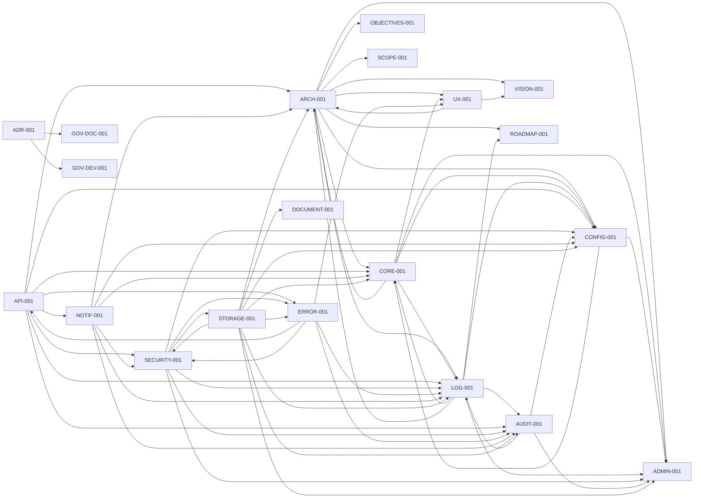
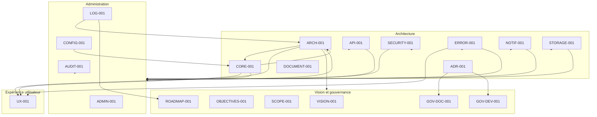

# ARCH-CONSOLIDATION-001-GRAPH

# Graphe des dépendances documentaires — M2.2

| Propriété | Valeur |
|---|---|
| **Document parent** | ARCH-CONSOLIDATION-001 |
| **Livrable** | M2.2 — Graphe documentaire |
| **Version** | 1.0.0 |
| **Statut** | Livrable de travail |
| **Nature** | Cartographie descriptive non normative |
| **Propriétaire** | Product Owner |
| **Dernière mise à jour** | 2026-07-21 |
| **Version du produit** | V1.1 |

---

# 1. Objet

Ce document représente graphiquement les dépendances documentaires explicites recensées dans la matrice M2.1 du chantier `ARCH-CONSOLIDATION-001`.

Le graphe ne crée aucune dépendance nouvelle. Il reprend uniquement les relations identifiées dans les métadonnées, le catalogue `INDEX-001` ou le contenu des documents consultés.

Une flèche `A --> B` signifie que le document **A référence explicitement le document B**.

---

# 2. Graphe documentaire consolidé

---

# 3. Vue par familles documentaires

---

# 4. Boucles de références observées

Les relations suivantes forment des références réciproques explicites :

| Document A | Document B | Relation observée |
|---|---|---|
| ARCH-001 | CORE-001 | Référence réciproque |
| ARCH-001 | LOG-001 | Référence réciproque |
| ARCH-001 | UX-001 | Référence réciproque |
| CORE-001 | CONFIG-001 | Référence réciproque |
| CORE-001 | LOG-001 | Référence réciproque |
| CORE-001 | NOTIF-001 | Référence réciproque |
| CONFIG-001 | LOG-001 | Référence réciproque |
| CONFIG-001 | AUDIT-001 | Référence réciproque |
| CONFIG-001 | SECURITY-001 | Référence réciproque |
| CONFIG-001 | NOTIF-001 | Référence réciproque |
| CONFIG-001 | STORAGE-001 | Référence réciproque |
| LOG-001 | AUDIT-001 | Référence réciproque |
| LOG-001 | SECURITY-001 | Référence réciproque |
| LOG-001 | ERROR-001 | Référence réciproque |
| LOG-001 | NOTIF-001 | Référence réciproque |
| LOG-001 | STORAGE-001 | Référence réciproque |
| API-001 | ERROR-001 | Référence réciproque |
| SECURITY-001 | ERROR-001 | Référence réciproque |
| SECURITY-001 | STORAGE-001 | Référence réciproque |
| AUDIT-001 | ERROR-001 | Référence réciproque |
| AUDIT-001 | NOTIF-001 | Référence réciproque |
| AUDIT-001 | STORAGE-001 | Référence réciproque |
| ERROR-001 | STORAGE-001 | Référence réciproque |

Ce relevé est descriptif. L'interprétation des boucles, des recouvrements et des responsabilités relève du jalon M3.

---

# 5. Résultat du sous-jalon M2.2

Le graphe représente les relations explicites recensées dans la matrice M2.1 et distingue les familles documentaires concernées.

Le sous-jalon **M2.2 — Graphe documentaire** est produit.

Sa validation permettra :

- de clôturer le jalon M2 ;
- d'ouvrir le jalon M3 — Analyse des responsabilités ;
- d'utiliser les références réciproques comme points d'entrée de l'analyse, sans préjuger d'une migration documentaire.
